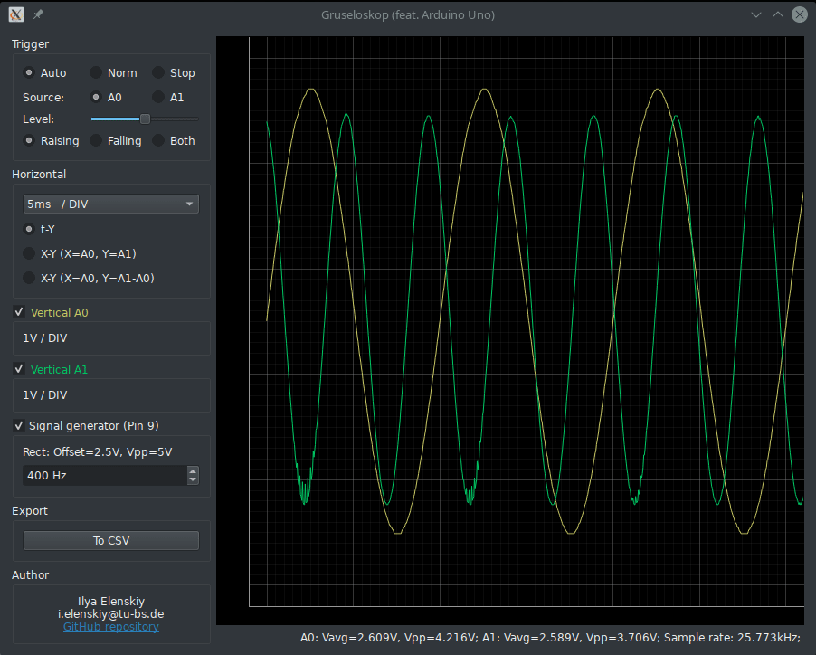

[](https://www.gnu.org/licenses/gpl-3.0)

# Gruseloskop

Gruseloskop (German worldplay refering to an imagination of having
this as the only tool in your lab) is a simple oscilloscope GUI for Arduino Uno. 

> **Companion Arduino Uno sketch must be manually flashed using [Arduino IDE][arduino]**
> You can find the sketch under [firmware][firmware]. 

 

This is a project hacked together over a weekend and is not regularly maintained. 
Keep bleach closely available at all times to wash you eyes in case you accidentally see
the source code. Consider yourself lucky if you find a comment there.

## Installation

### On Linux

First, ensure that [Qt][qt] is installed on your system. Use `pip` to install the GUI,
note that it will automatically install [PySide2][pyside] Qt bindings.

```sh
pip install gruseloskop
```

### On Windows

TODO: exe package

### Firmware

Connect you Arduino Uno and use the IDE to compile and install the [firmware][firmware].
`TimerOne` library must be installed for this to compile, which can be done in the IDE
using *Sketch->Include Library->Manage Libraries...* menu.

## Capabilities

Currently, selectable edge triggers are supported. After each trigger, the arduino will 
sample `A0` and `A1` channel at 8 bit, filling 800 sample buffer. The sample rate is 
chosen such that at least one screen of the GUI is filled at can currently achieve about
25kHz. Pin 9 can be used as a 5V rectangle wave generator output with selectable 
frequency. There are no vertical controls.

Be careful with the **reference voltage**: to achieve a 5V input range the Vcc of the 
Board is used. When connected to USB only, this is subject to an **USB supply tolerance
of up to 10%!** When connected to an external supply, the on-board linear regulator will 
likely provide more reproducible results, so use it when possible.


<!-- Markdown link & img dfn's -->
[arduino]: https://www.arduino.cc/en/software
[firmware]: https://github.com/EvilMav/gruseloskop/tree/master/firmware
[qt]: https://www.qt.io/
[pyside]: https://wiki.qt.io/Qt_for_Python